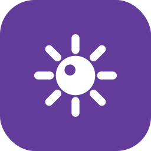

<br>
<br>
<br>
<br>
<p align="center">
  
</p>
<h1 align="center">YiMines</h1>
<h3 align="center">Just another minesweeper, simple yet beautiful.</h3>

<p align="center">A clean, lightweight, and privacy-first minesweeper, crafted with Material You and modern web engineering.</p>
<p align="center">Made with ❤️ by <a href="https://github.com/lingyicute">lingyicute</a>.</p>
<br>
<br>
<p align="center">
  [🇺🇸 English] •
  <a href="https://github.com/lingyicute/YiMines">🌐 Source Code</a> •
  <a href="https://github.com/lingyicute/YiMines/issues">🐛 Report Bug</a>
</p>

<p align="center">
  <a href="LICENSE"></a>
  <a href="index.html"></a>
  <a href="https://github.com/lingyicute/YiMines"></a>
  <a href="https://github.com/lingyicute/YiMines"></a>
  <a href="https://github.com/lingyicute/YiMines"></a>
</p>
<br>

## 📖 Overview

Minesweeper is usually either a puzzle buried under banner ads, or a hard-coded grid that punishes you with a 50/50 guess on the first click and forgets your best time the moment you close the tab.

**YiMines** keeps the classic rules and fixes the annoyances. Your opening click is **guaranteed safe and never adjacent to a mine**, numbers can be **chorded** to clear their neighbourhoods, and best times plus win-rate statistics are kept locally. The entire game — markup, styles, logic, font — is **one self-contained HTML file** with **zero dependencies** and **zero network requests**.

<br>

## ✨ Features

- **💥 Minesweeper That Respects Your Time**
  - **Guaranteed safe first click** — never a mine, and never adjacent to one, so you always get a real opening instead of a coin flip.
  - **Chord to clear** — click a revealed number whose neighbouring flag count matches and every remaining neighbour opens at once.
  - **Flag mode** for touch screens, plus long-press and right-click flagging for muscle memory.
  - Live **mines remaining** counter and an **elapsed-time** clock above the board.

- **🎯 Four Board Sizes**
  - **简单 Easy** 9×9 / 10 mines · **中等 Medium** 12×12 / 24 · **困难 Hard** 16×16 / 40 · **专家 Expert** 16×24 / 80.
  - Difficulty chips switch instantly; the layout re-flows into a landscape arrangement on wide screens so the expert grid stays readable on a desktop.

- **📊 Records & Statistics**
  - **Best time per difficulty**, plus **games played, games won and win rate** in a single stats dialog.
  - A "new record" callout when you beat your personal best; and there is a button to wipe the slate clean.

- **📳 Feedback That Feels Physical**
  - Distinct **haptic patterns** for reveals, flags, wins and explosions via `navigator.vibrate` on supporting devices.
  - Per-digit number colours, tuned separately for light and dark schemes.

- **🎨 Material You & Polished Design**
  - **Dynamic theming**: eight accent hues, each generating a complete Material token set (background, surfaces, primary, containers, outlines, cell tones) for both modes.
  - **Day / Night mode** with the initial choice taken from `prefers-color-scheme`, `<meta name="theme-color">` kept in sync, and `prefers-reduced-motion` respected.
  - Win / loss overlays with a per-round summary.

- **🔒 100% Privacy, Offline & Ad-Free**
  - **Zero network requests** — the game is fully self-contained and works with the network switched off.
  - Records, difficulty and theme live in `localStorage` (`yimines-*`); nothing is ever uploaded.
  - Licensed under **AGPL-3.0**.

- **⌨️ Playable Without a Mouse**
  - Arrow keys or `W A S D` move a cursor, `Space` reveals, `F` flags, `R` restarts; the board scrolls to follow the cursor.
  - ARIA grid semantics, labelled buttons and focus-visible outlines throughout.

<br>

## 🛠️ Why YiMines? (Under the Hood)

### 1. The First Click Is Always Safe
Boards are generated around your opening move: the first cell *and* its eight neighbours are excluded from mine placement, and the reveal is applied before the clock starts. No luck tax, no restarts — the opening position is always a genuine piece of information to reason from.

### 2. Material You Theming with Real Tactile Feedback
Each of the eight accents drives a hue variable that every colour token is computed from, so the board, chips and dialogs retint as one system rather than in patches. On top of that, the game answers your taps with device haptics and per-digit number colours, so a chord that opens twelve cells *feels* like it did something.

### 3. Zero-Dependency, Zero-Network Architecture
`index.html` contains everything — including a base64-embedded subset of the "Nebulove" typeface — and makes **no external requests at all**. That means it runs from `file://`, from a static host, or offline on a phone, and there is nothing to audit: no framework, no bundler, no analytics, no backend.

<br>

## 🚀 Play It Now

There is nothing to install — the game *is* one HTML file.

### Option 1 — Just open it
Download `index.html` (or clone the repository) and double-click the file. It works straight from disk, offline.

### Option 2 — Serve it locally
```bash
git clone https://github.com/lingyicute/YiMines.git
cd YiMines
python3 -m http.server 8000     # then open http://localhost:8000
```

### Option 3 — Publish it anywhere
Drop `index.html` on GitHub Pages, Cloudflare Pages, Netlify or any static host — a single file is the entire deployment.

### Requirements
- **Browser**: any modern browser (Chrome, Edge, Firefox, Safari, or their mobile counterparts).
- **Network**: not required. Zero requests are made to any server.
- **Storage**: `localStorage` only, for settings, records and statistics.
- **Permissions**: none — vibration is used only if your device offers it.

<br>

## 🔨 Building from Source

There is no bundler and no dependency to install: `index.html` *is* the artifact. The one generated part — the embedded font subset — has its generator checked in.

1. **Clone the repository**:
   ```bash
   git clone https://github.com/lingyicute/YiMines.git
   cd YiMines
   ```

2. **Edit and reload** — the file is organised with banner comments (board generation, state, rendering, theming, dialogs), so the solver-ish parts and the UI parts stay easy to navigate.

3. **Ship it** — commit and push; with GitHub Pages enabled, the update is live immediately.

### Regenerating the embedded font subset

The page embeds a ~33.6 KB subset (298 glyphs) of the 1.25 MB "Nebulove" typeface instead of linking it from a CDN, which is what keeps the "zero network requests" promise. When you add or change **user-visible text**, regenerate the subset — otherwise the new characters are simply not in the font and fall back to a system font:

```bash
pip install fonttools brotli
python3 scripts/subset_font.py          # rewrites the @font-face block of index.html in place
```

- The script is **idempotent**: re-running it on an unchanged page produces no diff, and it reports any characters the typeface itself does not contain (currently ❤️ and 🎉, which fall back to the system emoji font).

<br>

## 🤗 Contributing

Contributions are always welcome!
- **Bug Reports & Feature Requests**: submit an issue on the [GitHub Issue Tracker](https://github.com/lingyicute/YiMines/issues).
- **Pull Requests**: keep the single-file, zero-dependency philosophy intact and match the existing code style.
- **Translations**: the interface is currently Simplified Chinese — an i18n layer plus translated string tables would be very welcome.

<br>

## 📄 License

```text
Copyright (C) 2026 lingyicute <li@92li.uk>

This program is free software: you can redistribute it and/or modify
it under the terms of the GNU Affero General Public License as published by
the Free Software Foundation, either version 3 of the License, or
(at your option) any later version.

This program is distributed in the hope that it will be useful,
but WITHOUT ANY WARRANTY; without even the implied warranty of
MERCHANTABILITY or FITNESS FOR A PARTICULAR PURPOSE. See the
GNU Affero General Public License for more details.

You should have received a copy of the GNU Affero General Public License
along with this program. If not, see <https://www.gnu.org/licenses/>.
```
